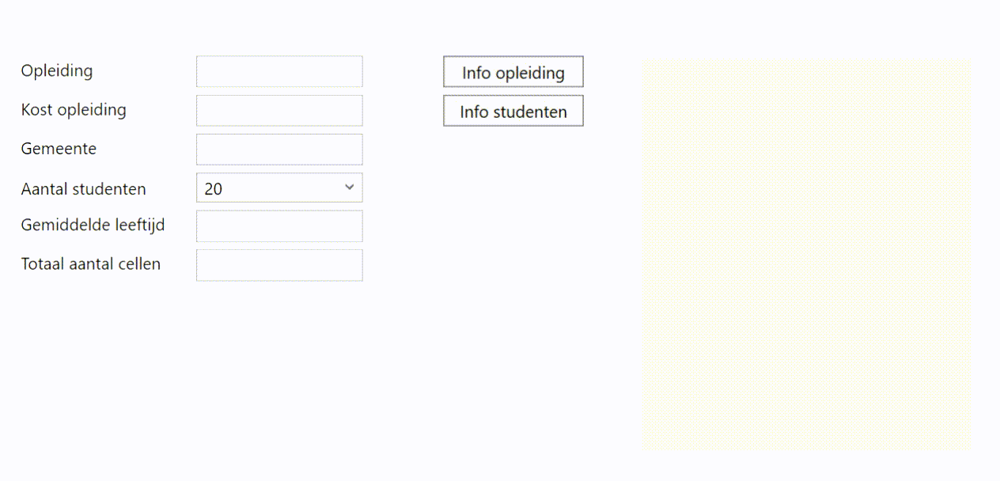

# OpleidingsInfo
Vul info over een opleiding in en toon een samenvatting van de info over de opleiding en over de studenten. 

## Naamgeving
Geef alle controls een naam volgens de afspraken, waar dit nodig is.

## Datatypes
Kies voor de opgevraagde informatie het juiste datatype voor de variabelen:
- kost van de opleiding: geldbedrag
- aantal: relatief klein geheel getal
- gemiddelde leeftijd: kommagetal
- cellen: heel groot geheel getal

## Bij het opstarten
Vul de combobox voor het aantal studenten op met de getallen van 20 tot en met 25.

Toon het eerste item in deze combobox.

## Klik op de knop *Info opleiding*
Toon een samenvatting met de naam van de opleiding, de locatie en de kost in de textblock.

## Klik op de knop *Info studenten*
Toon een samenvatting met de naam van de opleiding, het aantal studenten, de gemiddelde leeftijd en het aantal hersencellen in de textblock.

