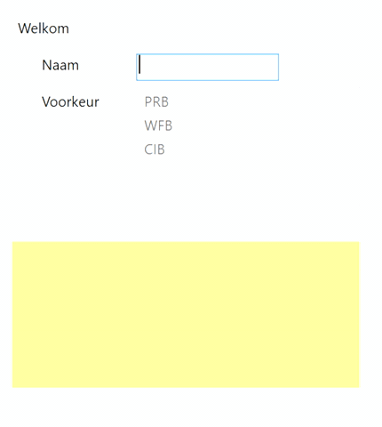

Breng de volgende functionaliteiten aan:

•	Tijdens het opstarten moet de knop btnOK onzichtbaar gemaakt worden, en moeten er aan lstPreference de waarden “PRB” , “WFB” en “CIB” toegevoegd worden.

> *Tip

> Je maakt een control zichtbaar of onzichtbaar door de eigenschap “Visibility” in te stellen. 
Je kan aan deze eigenschap (o.a.) de volgende waarden toekennen :
> * Visibility.Visible : de control is zichtbaar
> * Visibility.Hidden : de control is onzichtbaar maar er wordt plaats vrijgehouden
> *	Visibility.Collapsed : de control is onzichtbaar en er wordt geen plaats vrijgehouden.

•	Wanneer er getypt wordt in txtName dient de knop btnOK zichtbaar gemaakt worden.

> Tip 1
> gebruik hiervoor het TextChanged event van txtName
 
> Tip 2
> wens je dat de knop btnOK weer verdwijnt wanneer er geen tekst ingevoerd is (de gebruiker heeft het tekstvak leeggemaakt) dan kan je als volgt te werk gaan (we zien dit uitgebreid in een volgend hoofdstuk):

>  > if(txtName.Text.Length == 0) btnOK.Vis...;

>  > else btnOK.Vis...;

•	Wanneer je op de knop btnOK klikt, dan dient de inhoud van txtName in de variabele **name**
bewaard worden.
Opgelet ! De inhoud van de variabele name moet in meerdere (2) event-handlers beschikbaar te zijn.
Tenslotte verandert de inhoud van lblWelcome in “Welkom in Howest, “ + de inhoud van de variabele name.

•	Wanneer je een waarde aanklikt in lstPreference, dan dient de geselecteerde waarde in de variabele **preferredCourse** bewaard te worden.
Opgelet ! Deze variabele dient enkel gekend te zijn binnen deze event-handler.
In tbkFeedback wordt de inhoud van deze variabele **name** getoond, gevolgd door de tekst “, je voorkeur gaat uit naar “, gevolgd door de waarde in de variabele **preferredCourse**.

