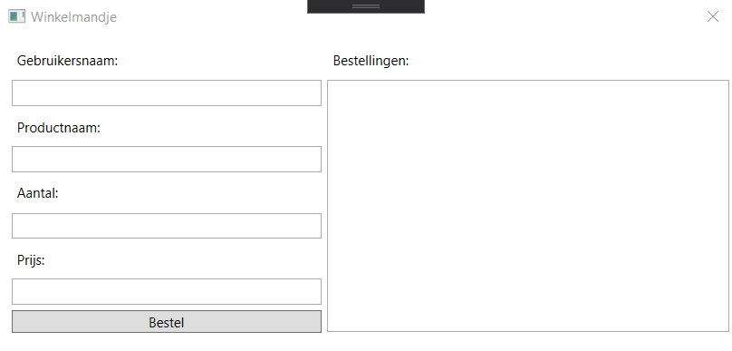

# Winkelmandje

## Doel
Maak een winkelmandje waarin een gebruiker een aantal gegevens kan invullen.
De gegevens zijn het volgende:
* Een gebruikersnaam
* Een product(naam)
* Het aantal producten dat besteld moet worden
* De prijs van het product

## Vereisten
* Maak gebruik van variabelen om de gegevens bij te houden
* Na het klikken op de knop 'bestel', wordt de prijs van het gekozen product berekend en wordt er info getoond over de bestelling in een ListBox.
* De gebruikersnaam wordt altijd in drukletters omgezet
* De productnaam wordt altijd in kleine letters weergegeven

## Belangrijke opmerkingen
* __!! alle getallen zijn gehele getallen !!__
* We doen (nog niet) aan foutenopgaving. Het ingeven van foutieve waardes zal resulteren in crashes.

## Tips
* Ga na welke variabelen omgezet moeten worden van datatype om ermee te kunnen rekenen. De waarden die je binnenkrijgt uit de textboxes zijn van het type string.

## Applicatie in werking:

## Uitbreidingen
## Usability
* Maak je applicatie gebruiksvriendelijker. Zorg ervoor dat na het klikken op de bestelknop, de textboxes weer leeg worden (de gebruikersinvoer wordt dus weer gewist).

## Scope van variabelen
* Maak een nieuwe Button en zorg ervoor de naam van de laatste gebruiker bijgehouden wordt. Na het klikken op de knop krijg je een MessageBox te zien met de naam van de gebruikersnaam die het laatst werd ingevoerd.
